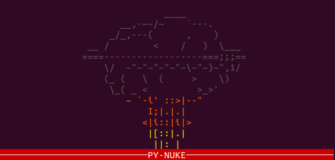

# py-nuke
Want to get rid of a file? But without destroying it completely? Why not use PyNuke? Make your file practically unreadable with **HEAVY** encryption!

Be cautious with this tool and don't nuke anything you'd want to keep readable/useable ;)

